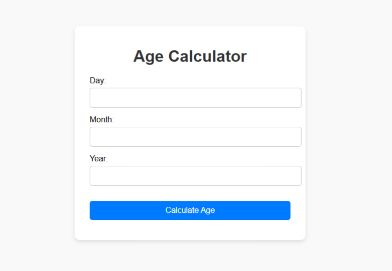

# Age Calculator

A simple, web-based **Age Calculator** that lets users calculate their age based on their date of birth. Built with **HTML**, **CSS**, and **JavaScript**, this project is perfect for beginners to understand JavaScript's `Date` object and basic DOM manipulation.

---

## 🌟 Features
- Allows users to input their day, month, and year of birth.
- Calculates the exact age in years based on the current date.
- Handles edge cases where the birthday hasn't occurred yet in the current year.
- Provides real-time error feedback for invalid dates.
- Simple, responsive design for easy use.

---

## 🚀 Demo
You can try the live version of the Age Calculator [here](#) (replace `#` with the live link, if hosted).

Alternatively, see the screenshot below:



---

## 🛠️ Installation

To run this project locally, follow these steps:

1. **Clone the Repository**:
   ```bash
   git clone https://github.com/yourusername/age-calculator.git
